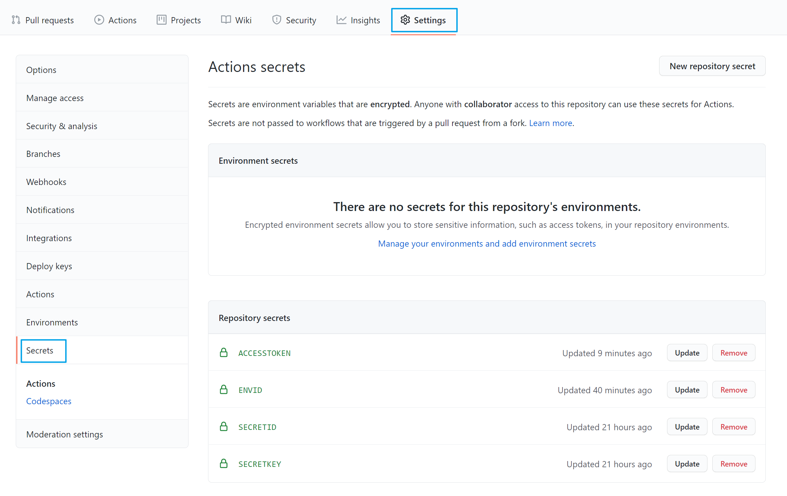

# Tencent CloudBase Github Action

[](https://github.com/marketplace/actions/tencent-cloudbase-github-action)

[](https://github.com/TencentCloudBase/cloudbase-action/actions)

云开发 Tencent CloudBase Github Action 借力于 [Cloubase-Freamwork](https://github.com/Tencent/cloudbase-framework)，可以将 Github 项目自动部署到云开发环境

如果你目前使用的是 Tencent CloudBase Github Action V1 版本，请参考 [V1 README](https://github.com/TencentCloudBase/cloudbase-action/blob/3354b442713265aa9d7c5bf03b0b8cb0173f546f/README.md)，推荐使用 V2 版本以获取更多功能

[🚀 在项目中使用此扩展](https://github.com/marketplace/actions/tencent-cloudbase-github-action)

- 云开发官网地址： [https://cloudbase.net/](https://cloudbase.net/)
- 云开发控制台地址： [https://console.cloud.tencent.com/tcb](https://console.cloud.tencent.com/tcb)

支持列表：

- 部署静态网站
- 部署云函数
- 部署到云托管环境
- 部署微信小程序应用
- 配置登录鉴权和云数据库

完整列表请查看[插件介绍](https://docs.cloudbase.net/framework/plugins/)

## 输入参数

> 提示：标注 🔐 的参数属于敏感信息，需要放在项目的 `secret` 存储中，用法可以参考最后的实例

### `secretId` 🔐

**Required** 云开发的访问密钥 secretId.

在腾讯云[访问管理](https://console.cloud.tencent.com/cam/capi)页面获取

### `secretKey` 🔐

**Required** 云开发的访问密钥 secretKey.

在腾讯云[访问管理](https://console.cloud.tencent.com/cam/capi)页面获取

### `envId` 🔐

**Required** 云开发的环境 id envId.

可以在云开发的[控制台](https://console.cloud.tencent.com/tcb/env/index)获取

## 配置文件

请确保项目根目录存在 `cloudbaserc.json` 文件并配置好 CloudBase Framework，[参考教程](https://docs.cloudbase.net/framework/config.html#pei-zhi-shuo-ming)

> 如果你的项目正在使用 CloudBase Framework，那么此 Action 就是 0 配置的

然后请根据你的需求引入相关插件，支持[自动检测生成插件配置](https://docs.cloudbase.net/framework/plugins/#zi-dong-jian-ce-sheng-cheng-cha-jian-pei-zhi)或[手动填写插件配置](https://docs.cloudbase.net/framework/plugins/#zi-dong-jian-ce-sheng-cheng-cha-jian-pei-zhi)

## 参考示例

**以下示例将演示：如何快速部署云函数到 CloudBase(同时设定部署的私密环境变量)**

1. 编写如下的 Github Action 文件 `.github/workflows/main.yml`

   ```yaml
   on: [push]

   jobs:
     deploy:
       runs-on: ubuntu-latest
       name: Tencent Cloudbase Github Action Example
       steps:
         - name: Checkout
           uses: actions/checkout@v2
         - name: Deploy to Tencent CloudBase
           uses: TencentCloudBase/cloudbase-action@v2
           with:
             secretId: ${{secrets.secretId}}
             secretKey: ${{secrets.secretKey}}
             envId: ${{secrets.envId}}
   ```

   假设我们在部署时需要设置私密型的环境变量(比如小程序 `appid`)，请在以上代码中新增以下内容：

   ```diff
    name: Tencent Cloudbase Github Action Example
    +env:
    +  accessToken: ${{ secrets.accessToken }}
   ```

   其中 `env` 下的 `ACCESS_TOKEN` 键值对是我们[部署时设置的环境变量](https://docs.github.com/en/actions/reference/environment-variables#about-environment-variables)，它的功能与本地的 `.env` 文件相同

2. 在项目中配置 `cloudbaserc.json` 文件并引入我们刚刚配置的环境变量：

   ```json
   {
     "envId": "{{env.ENV_ID}}",
     "version": "2.0",
     "framework": {
       "name": "gh-actions-test",
       "plugins": {
         "func": {
           "use": "@cloudbase/framework-plugin-function",
           "inputs": {
             "functions": [
               {
                 "name": "example",
                 "memorySize": 128,
                 "timeout": 5,
                 "runtime": "Nodejs10.15",
                 "handler": "index.main",
                 "envVariables": {
                   "accessToken": "{{env.accessToken}}"
                 }
               }
             ]
           }
         }
       }
     }
   }
   ```

3. 在项目 Settings/Secrets 里设置 `secretId`, `secretKey`, `envId`, `accessToken` 信息

   

4. 配置完成后，提交代码到 Github 时，就会自动部署项目中的 `example` 函数到云开发中，即时函数的环境变量也会设置成功

## 谁在用 Tencent CloudBase Github Action

- [Linux 中国: TLDR 命令查询工具](https://github.com/LCTT/tldr.linux.cn)
- [EndureBlaze/EndureBlaze.github.io](https://github.com/EndureBlaze/EndureBlaze.github.io)
